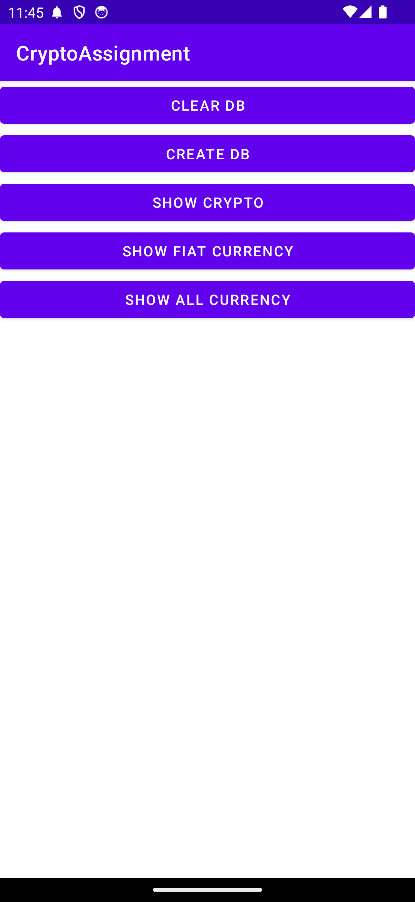
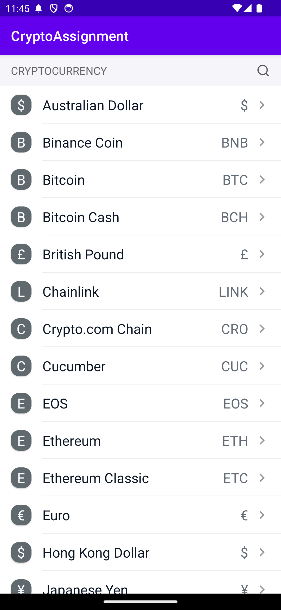
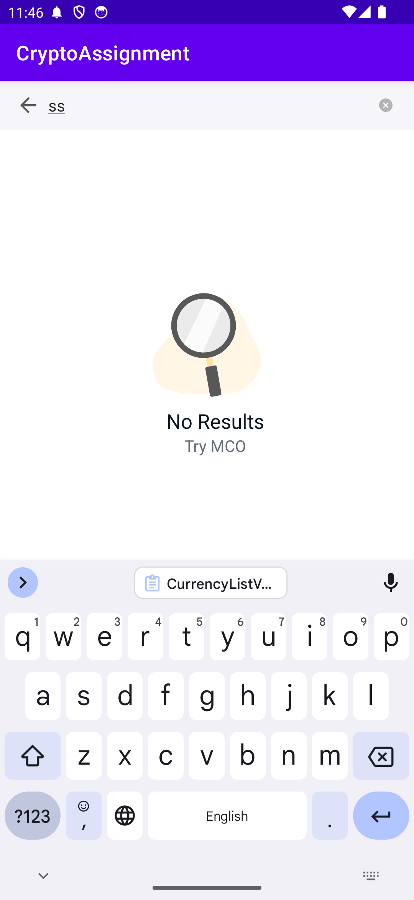

# Search Demo

  

## Overall Checklist

- [x] The **CurrencyListFragment** ([CurrencyListFragment.kt](app/src/main/java/com/cryptoassignment/ui/currency/CurrencyListFragment.kt)) is expected to receive an `ArrayList` of `CurrencyInfo` objects to create the UI.
- [x] The **DemoActivity** ([DemoActivity.kt](app/src/main/java/com/cryptoassignment/ui/demo/DemoActivity.kt)) should provide two datasets, **Currency List A** and **Currency List B**, which contain `CurrencyInfo` objects to be queried from the local database.
- [x] The **DemoActivity** should include five buttons for demonstrating various functionalities in the **DemoControlPanelFragment** ([DemoControlPanelFragment.kt](app/src/main/java/com/cryptoassignment/ui/demo/DemoControlPanelFragment.kt)):
    - [x] The first button clears the data in the local database.
    - [x] The second button inserts data into the local database.
    - [x] The third button changes the **CurrencyListFragment** to use **Currency List A** - Crypto.
    - [x] The fourth button changes the **CurrencyListFragment** to use **Currency List B** - Fiat.
    - [x] The fifth button displays all `CurrencyInfo` objects that can be purchased from **Currency List A** and **B**.
- [x] The **CurrencyListFragment** provides a search feature that can be canceled when the user clicks the back or close button.
- [x] The **CurrencyListFragment** includes an empty view for displaying when the list is empty.
- [x] All IO operations, including database or network access, are not performed on the UI thread to ensure smooth execution.

## Assignment Overview

Currently, there is only one module ([app](app)) without any modularization setup, as the requirements are minimal at this stage. However, the project is structured into three levels for future scalability:

- **Single Module Setup**:
    - **base**: Common tools or base implementations.
    - **data**: Raw data from remote/local sources.
    - **ui**: Application pages.
    - **di**: Dependency injection setup.

- **Modularization** (Future Plan):
    - Transition to this level when the following conditions are met:
        - Production level.
        - More than 10 developers working on this project.
        - The project is older than 2 years.
    - **Structure**:
        - **mobile**: Application with Dagger injection management.
        - **modules-core**: Basic core shared across all modules, including network and storage handling.
        - **modules-ui**: Components related to user interface display.
            - **core**: Base presenter, base activity & fragment if needed.
            - **feature-A**
            - **feature-B**

- **Single Activity Approach** (Future Plan):
    - Utilize a single `MainActivity` with multiple fragments for better management, such as global message reminders.

## Local Data

- **Currency Repository**:
    - Located at `app/data/repo/currency`: `CurrencyRepo`
        - Responsible for data conversion and local data management.

## Unit / UI Tests

- **Database Query Test**: [CurrencyDaoTest](app/src/androidTest/java/com/cryptoassignment/local/localcurrency/CurrencyDaoTest.kt)
    - [x] A coin will match if:
        - The coin’s name (e.g., Bitcoin) starts with the search term.
            - Example 1: Query: `foo`
                - Matches: Foobar
                - Does not match: Barfoo
            - Example 2: Query: `Ethereum`
                - Matches: Ethereum, Ethereum Classic
                - Does not match: -
    - OR -
        - The coin’s name contains a partial match with a space prefixed to the search term.
            - Example: Query: `Classic`
                - Matches: Ethereum Classic
                - Does not match: Tronclassic
        - OR -
            - The coin’s symbol starts with the search term.
                - Example: Query: `ET`
                    - Matches these symbols.

- Additional Tests:
    - [CurrencyRepoImplTest](app/src/test/java/com/cryptoassignment/data/repo/currency/CurrencyRepoImplTest.kt)
    - [CurrencyListViewModelTest](app/src/test/java/com/cryptoassignment/ui/currency/CurrencyListViewModelTest.kt)

## Considerations

- Implement error handling.
- Consider A/B testing for search conditions to make SQL queries dynamic.
    - This may require wrapping SQL query text and allowing different combinations to be passed to DAO.
    - Using `SimpleSQLiteQuery` to manage different search conditions could also be a viable approach.
- Define constant keys.
- Integrate LeakCanary & Crashlytics for monitoring.
- Conduct lint checks.
- Establish design components: Define text styles based on current requirements.
- Consider implementing a UseCase pattern if more complex business logic is needed.
- Set up CI/CD pipelines.
- Ensure landscape design compatibility.
- Increase unit test coverage.

## Tech Stack

- **Architecture**: MVVM (Clean Architecture)
- **Dependency Injection**: Dagger Hilt
- **Programming Language**: Kotlin
- **Design Patterns**: Repository Pattern

## References

- [Search Demo Documentation](challenge.pdf)